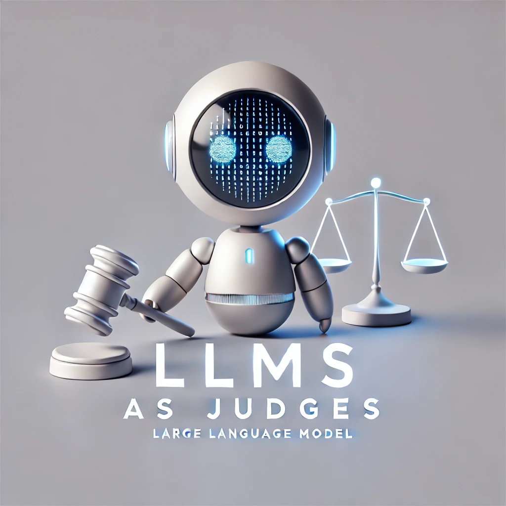
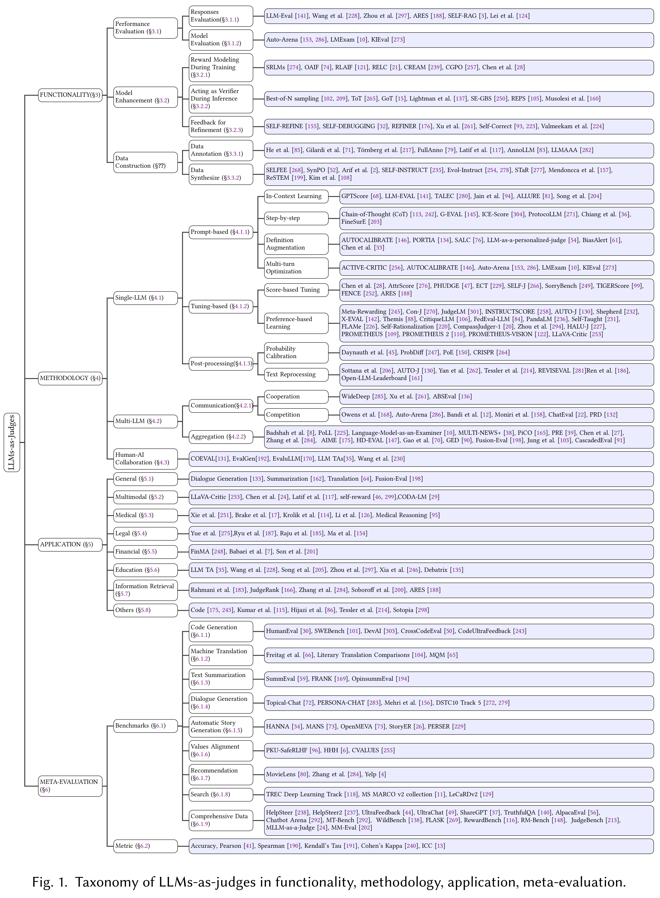
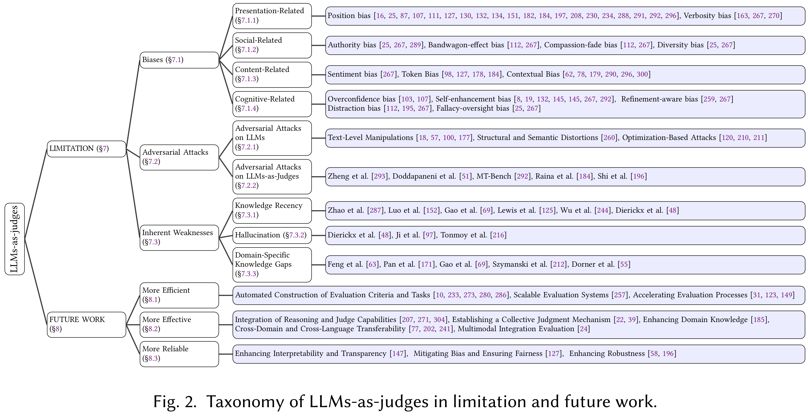
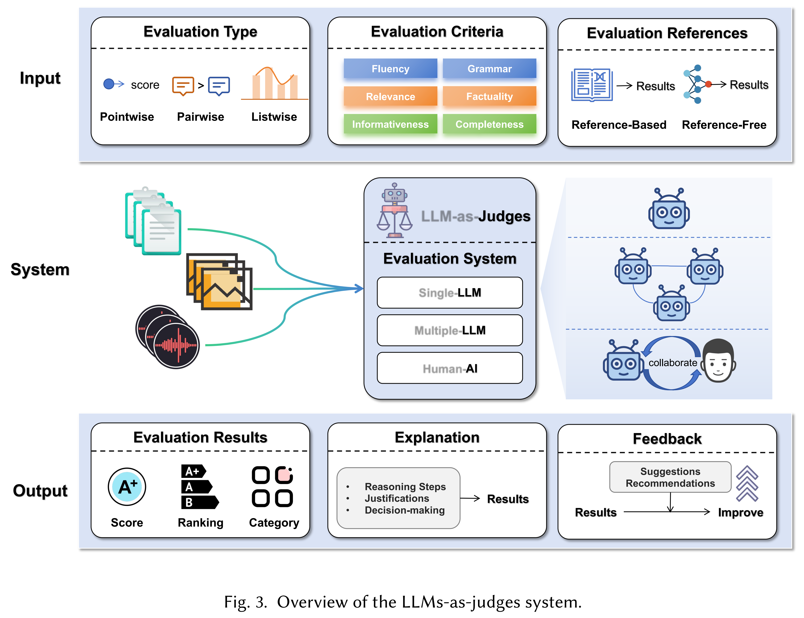

<div align="center">

</div>

# 🚀 Awesome-LLMs-as-Judges
[](https://github.com/sponsors)     

# 🌟 About This Repo
With the rapid development of LLMs, LLM-as-a-Judge has garnered widespread attention in both academia and industry. LLM judges are not only capable of serving as flexible evaluators in various fields such as text generation, question answering, and dialogue systems, but also facilitate the self-evolution and performance improvement of models. This repository aims to provide a one-stop resource for developers, researchers, and practitioners, helping them explore how to effectively leverage LLMs-as-Judges technology.

This repo include the papers discussed in our latest survey paper: 

📝[LLMs-as-Judges: A Comprehensive Survey on LLM-based Evaluation Methods.](https://arxiv.org/abs/2412.05579)

We will continuously track the latest developments in LLMs-as-Judges and regularly update the repository with the newest related papers. If you find this repository helpful, please give us a ⭐!

If you notice any work we've missed, please feel free to submit a pull request or contact us at email liht22@mails.tsinghua.edu.cn. 

We will update the repository and our paper. Welcome to discuss and contribute!

# 📚 Daily Papers on LLMs-as-Judges
[Daily Papers on LLMs-as-Judges](https://github.com/Deriq-Qian-Dong/arXivReporter/tree/main/LLMs-as-Judges) includes the latest paper titles and abstracts related to LLMs-as-Judges on arXiv, with information available in both English and Chinese.

# ⚡️ Update
🔥🔥 News: 2024/12/20: We have updated Daily Papers on LLMs-as-Judges (https://github.com/Deriq-Qian-Dong/arXivReporter/tree/main/LLMs-as-Judges), which automatically retrieves and updates daily papers from arXiv related to LLMs-as-Judges.

🔥🔥 News: 2024/12/14: We compiled papers related to LLMs-as-Judges presented at [NeurIPS 2024](NeurIPS.md).

🔥🔥 News: 2024/12/10: We released the first version of the [full paper](https://arxiv.org/abs/2412.05579).

🔥🔥 News: 2024/11/10: We completed the foundational work for the project and structured the framework.

# 🌳 Contents
- [🚀 Awesome-LLMs-as-Judges](#-awesome-llms-as-judges)
- [🌟 About This Repo](#-about-this-repo)
- [📚 Daily arXiv Papers on LLMs-as-Judges](#-daily-arxiv-papers-on-llms-as-judges)
- [⚡️ Update](#️-update)
- [🌳 Contents](#-contents)
- [📖 Cite Our Work](#-cite-our-work)
- [📚 Overview of Awesome-LLMs-as-Judges](#-overview-of-awesome-llms-as-judges)
- [📑 PaperList](#-paperlist)
- [1. Functionality](#1-functionality)
  - [1.1 Performance Evaluation](#11-performance-evaluation)
    - [1.1.1 Responses Evaluation](#111-responses-evaluation)
    - [1.1.2 Model Evaluation](#112-model-evaluation)
  - [1.2 Model Enhancement](#12-model-enhancement)
    - [1.2.1 Reward Modeling During Training](#121-reward-modeling-during-training)
    - [1.2.2 Acting as Verifier During Inference](#122-acting-as-verifier-during-inference)
    - [1.2.3 Feedback for Refinement](#123-feedback-for-refinement)
  - [1.3 Data Collection](#13-data-collection)
    - [1.3.1 Data Annotation](#131-data-annotation)
    - [1.3.2 Data Synthesize](#132-data-synthesize)
- [2. METHODOLOGY](#2-methodology)
  - [2.1 Single-LLM System](#21-single-llm-system)
    - [2.1.1 Prompt-based](#211-prompt-based)
      - [2.1.1.1 In-Context Learning](#2111-in-context-learning)
      - [2.1.1.2 Step-by-step](#2112-step-by-step)
      - [2.1.1.3 Definition Augmentation](#2113-definition-augmentation)
      - [2.1.1.4 Multi-turn Optimization](#2114-multi-turn-optimization)
    - [2.1.2 Tuning-based](#212-tuning-based)
    - [2.1.2.1 Score-based Tuning](#2121-score-based-tuning)
    - [2.1.2.2 Preference-based Learning](#2122-preference-based-learning)
    - [2.1.3 Post-processing](#213-post-processing)
    - [2.1.3.1 Probability Calibration](#2131-probability-calibration)
    - [2.1.3.2 Text Reprocessing](#2132-text-reprocessing)
  - [2.2 Multi-LLM System](#22-multi-llm-system)
    - [2.2.1 Communication](#221-communication)
      - [2.2.1.1 Cooperation](#2211-cooperation)
      - [2.2.1.2 Competition](#2212-competition)
    - [2.2.2 Aggregation](#222-aggregation)
  - [2.3 Human-AI Collaboration System](#23-human-ai-collaboration-system)
- [3. APPLICATION](#3-application)
  - [3.1 General](#31-general)
  - [3.2 Multimodal](#32-multimodal)
  - [3.3 Medical](#33-medical)
  - [3.4 Legal](#34-legal)
  - [3.5 Financial](#35-financial)
  - [3.6 Education](#36-education)
  - [3.7 Information Retrieval](#37-information-retrieval)
  - [3.8 Others](#38-others)
- [4. META-EVALUATION](#4-meta-evaluation)
  - [4.1 Benchmarks](#41-benchmarks)
    - [4.1.1 Code Generation](#411-code-generation)
    - [4.1.2 Machine Translation](#412-machine-translation)
    - [4.1.3 Text Summarization](#413-text-summarization)
    - [4.1.4 Dialogue Generation](#414-dialogue-generation)
    - [4.1.5 Automatic Story Generation](#415-automatic-story-generation)
    - [4.1.6 Values Alignment](#416-values-alignment)
    - [4.1.7 Recommendation](#417-recommendation)
    - [4.1.8 Search](#418-search)
    - [4.1.9 Comprehensive Data](#419-comprehensive-data)
  - [4.2 Metric](#42-metric)
- [5. LIMITATION](#5-limitation)
  - [5.1 Biases](#51-biases)
    - [5.1.1 Presentation-Related Biases](#511-presentation-related-biases)
    - [5.1.2 Social-Related Biases](#512-social-related-biases)
    - [5.1.3 Content-Related Biases](#513-content-related-biases)
    - [5.1.4 Cognitive-Related Biases](#514-cognitive-related-biases)
  - [5.2 Adversarial Attacks](#52-adversarial-attacks)
    - [5.2.1 Adversarial Attacks on LLMs](#521-adversarial-attacks-on-llms)
    - [5.2.2 Adversarial Attacks on LLMs-as-Judges](#522-adversarial-attacks-on-llms-as-judges)
  - [5.3 Inherent Weaknesses](#53-inherent-weaknesses)
    - [5.3.1 Knowledge Recency](#531-knowledge-recency)
    - [5.3.2 Hallucination](#532-hallucination)
    - [5.3.3 Domain-Specific Knowledge Gaps](#533-domain-specific-knowledge-gaps)
- [👏 Welcome to discussion](#-welcome-to-discussion)


# 📖 Cite Our Work
If you find our work useful, please do not save your star and cite our work:
```
@misc{li2024llmsasjudgescomprehensivesurveyllmbased,
      title={LLMs-as-Judges: A Comprehensive Survey on LLM-based Evaluation Methods}, 
      author={Haitao Li and Qian Dong and Junjie Chen and Huixue Su and Yujia Zhou and Qingyao Ai and Ziyi Ye and Yiqun Liu},
      year={2024},
      eprint={2412.05579},
      archivePrefix={arXiv},
      primaryClass={cs.CL},
      url={https://arxiv.org/abs/2412.05579}, 
}
```

# 📚 Overview of Awesome-LLMs-as-Judges




# 📑 PaperList

# 1. Functionality

## 1.1 Performance Evaluation
### 1.1.1 Responses Evaluation
- **Llm-eval: Unified multi-dimensional automatic evaluation for open-domain conversations with large language models**
  
  ACL 2023. [[Paper](https://arxiv.org/abs/2305.13711)]
- **Automated Genre-Aware Article Scoring and Feedback Using Large Language Models**
  
  arXiv 2024. [[Paper](https://arxiv.org/abs/2410.14165)]
- **Is LLM a Reliable Reviewer? A Comprehensive Evaluation of LLM on Automatic Paper Reviewing Tasks**
  
  LREC-COLING 2024. [[Paper](https://aclanthology.org/2024.lrec-main.816/)]
- **Ares: An automated evaluation framework for retrieval-augmented generation systems**
  
  NAACL 2024. [[Paper](https://arxiv.org/abs/2311.09476)]
- **Self-rag: Learning to retrieve, generate, and critique through self-reflection**
  
  ICLR 2024. [[Paper](https://arxiv.org/abs/2310.11511)]
- **RecExplainer: Aligning Large Language Models for Explaining Recommendation Models** 
  
  KDD 2024. [[Paper](https://dl.acm.org/doi/10.1145/3637528.3671802)]
### 1.1.2 Model Evaluation
- **Judging llm-as-a-judge with mt-bench and chatbot arena**
  
  NeurIPS 2023. [[Paper](https://arxiv.org/abs/2306.05685)]
- **Auto Arena of LLMs: Automating LLM Evaluations with Agent Peer-battles and Committee Discussions**
  
  arXiv 2024. [[Paper](https://arxiv.org/abs/2405.20267)]
- **VideoAutoArena: An Automated Arena for Evaluating Large Multimodal Models in Video Analysis through User Simulation**
  
  arXiv 2024. [[Paper](https://arxiv.org/abs/2411.13281)]
- **Benchmarking foundation models with language-model-as-an-examiner**
  
  NeurIPS 2023. [[Paper](https://arxiv.org/abs/2306.04181)]
- **Kieval: A knowledge-grounded interactive evaluation framework for large language models**
  
  ACL 2024. [[Paper](https://arxiv.org/abs/2402.15043)]
## 1.2 Model Enhancement
### 1.2.1 Reward Modeling During Training
- **Self-rewarding language models**
  
  ICML 2024. [[Paper](https://arxiv.org/abs/2401.10020)]
- **Direct language model alignment from online ai feedback**
  
  arXiv 2024. [[Paper](https://arxiv.org/abs/2402.04792)]
- **Rlaif: Scaling reinforcement learning from human feedback with ai feedback**
  
  arXiv 2024.[[Paper](https://arxiv.org/abs/2309.00267)]
- **Enhancing Reinforcement Learning with Dense Rewards from Language Model Critic**
  
  EMNLP 2024. [[Paper](https://aclanthology.org/2024.emnlp-main.515/)]
- **Cream: Consistency regularized self-rewarding language models**
  
  arXiv 2024. [[Paper](https://arxiv.org/abs/2410.12735)]
- **The perfect blend: Redefining RLHF with mixture of judges**
  
  arXiv 2024. [[Paper](https://arxiv.org/abs/2409.20370)]

- **Adaptation with Self-Evaluation to Improve Selective Prediction in LLMs**
  
  EMNLP (findings) 2023. [[Paper](https://aclanthology.org/2023.findings-emnlp.345.pdf)]

### 1.2.2 Acting as Verifier During Inference
- **Regularized Best-of-N Sampling to Mitigate Reward Hacking for Language Model Alignment**
  
  arXiv 2024. [[Paper](https://arxiv.org/abs/2404.01054)]
- **Fast Best-of-N Decoding via Speculative Rejection**
  
  NeurIPS 2024 [[Paper](https://arxiv.org/abs/2410.20290)]
- **Tree of thoughts: Deliberate problem solving with large language models** 
  
  NeurIPS 2024. [[Paper](https://arxiv.org/abs/2305.10601)]
- **Graph of thoughts: Solving elaborate problems with large language models**
  
  AAAI 2024.[[Paper](https://arxiv.org/abs/2308.09687)]
- **Let’s verify step by step**
  
  ICLR 2024. [[Paper](https://arxiv.org/abs/2305.20050)]
- **Self-evaluation guided beam search for reasoning**
  
  NeurIPS 2024. [[Paper](https://arxiv.org/abs/2305.00633)]
- **Rationale-Aware Answer Verification by Pairwise Self-Evaluation**
  
  arXiv 2024. [[Paper](https://arxiv.org/abs/2410.04838)]
- **Creative Beam Search: LLM-as-a-Judge for Improving Response Generation**. 
  
  ICCC 2024. [[Paper](https://arxiv.org/abs/2405.00099)]


### 1.2.3 Feedback for Refinement
- **Self-refine: Iterative refinement with self-feedback**
  
  NeurIPS 2024. [[Paper](https://arxiv.org/abs/2303.17651)]
- **Teaching large language models to self-debug**
  
  arXiv 2023. [[Paper](https://arxiv.org/abs/2304.05128)]
- **Refiner: Reasoning feedback on intermediate representations**
  
  EACL 2024. [[Paper](https://arxiv.org/abs/2304.01904)]
- **Towards reasoning in large language models via multi-agent peer review collaboration**
  
  arXiv 2023. [[Paper](https://arxiv.org/abs/2311.08152)]
- **Large language models cannot self-correct reasoning yet**
  
  ICLR 2024. [[Paper](https://arxiv.org/abs/2310.01798)]
- **LLMs cannot find reasoning errors, but can correct them!**
  
  ACL (findings) 2024. [[Paper](https://arxiv.org/abs/2311.08516)]
- **Can large language models really improve by self-critiquing their own plans?**
  
  NeurIPS (Workshop) 2023. [[Paper](https://arxiv.org/abs/2310.08118)]

## 1.3 Data Collection
### 1.3.1 Data Annotation
- **If in a Crowdsourced Data Annotation Pipeline, a GPT-4**
  
  CHI 2024. [[Paper](https://arxiv.org/abs/2402.16795)]
- **ChatGPT outperforms crowd workers for text-annotation tasks**
  
  PNAS 2023.[[Paper](https://arxiv.org/abs/2303.15056)]
- **ChatGPT-4 outperforms experts and crowd workers in annotating political Twitter messages with zero-shot learning**
  
  arXiv 2023. [[Paper](https://arxiv.org/abs/2304.06588)]
- **Fullanno: A data engine for enhancing image comprehension of MLLMs**
  
  arXiv 2024. [[Paper](https://arxiv.org/abs/2409.13540)]
- **Can large language models aid in annotating speech emotional data? Uncovering new frontiers** 
  
  IEEE 2024. [[Paper](https://arxiv.org/abs/2307.06090)]
- **Annollm: Making large language models to be better crowdsourced annotators**
  
  NAACL 2024. [[Paper](https://arxiv.org/abs/2303.16854)]
- **LLMAAA: Making large language models as active annotators**
  
  EMNLP (findings) 2023. [[Paper](https://arxiv.org/abs/2310.19596)]

### 1.3.2 Data Synthesize
- **Selfee: Iterative self-revising LLM empowered by self-feedback generation**
  
  Blog post 2023.[[Blog](https://lklab.kaist.ac.kr/SelFee/)]
- **Self-Boosting Large Language Models with Synthetic Preference Data**
  
  arXiv 2024. [[Paper](https://arxiv.org/abs/2410.06961)]
- **The fellowship of the LLMs: Multi-agent workflows for synthetic preference optimization dataset generation**
  
  arXiv 2024. [[Paper](https://arxiv.org/abs/2408.08688)]
- **Self-consistency improves chain of thought reasoning in language models**
  
  ICLR 2023. [[Paper](https://arxiv.org/abs/2203.11171)]
- **WizardLM: Empowering large language models to follow complex instructions**
  
  ICLR 2024. [[Paper](https://arxiv.org/abs/2304.12244)]
- **Automatic Instruction Evolving for Large Language Models**
  
  EMNLP 2024. [[Paper](https://arxiv.org/abs/2406.00770)]
- **STaR: Self-taught reasoner bootstrapping reasoning with reasoning**
  
  NeurIPS 2022. [[Paper](https://arxiv.org/abs/2203.14465)]
- **Beyond human data: Scaling self-training for problem-solving with language models**
  
  arXiv 2023. [[Paper](https://arxiv.org/abs/2312.06585)]

- **SAFER-INSTRUCT: Aligning Language Models with Automated Preference Data**

  NAACL 2024. [[Paper](https://aclanthology.org/2024.naacl-long.422.pdf)]

- **soda-eval: open-domain dialogue evaluation in the age of llms**

  EMNLP (findings) 2024. [[Paper](https://aclanthology.org/2024.findings-emnlp.684.pdf)]

# 2. METHODOLOGY
## 2.1 Single-LLM System
### 2.1.1 Prompt-based
#### 2.1.1.1 In-Context Learning
- **A systematic survey of prompt engineering in large language models: Techniques and applications**

  arXiv 2024. [[Paper](https://arxiv.org/abs/2402.07927)]
- **A survey on in-context learning**

  arXiv 2022. [[Paper](https://arxiv.org/abs/2301.00234)]
- **Gptscore: Evaluate as you desire**

  arXiv 2023. [[Paper](https://arxiv.org/abs/2302.04166)]
- **Llm-eval: Unified multi-dimensional automatic evaluation for open-domain conversations with large language models**

  NLP4ConvAI 2023. [[Paper](https://arxiv.org/abs/2305.13711)]
- **TALEC: Teach Your LLM to Evaluate in Specific Domain with In-house Criteria by Criteria Division and Zero-shot Plus Few-shot**

  arXiv 2024. [[Paper](https://arxiv.org/abs/2407.10999)]
- **Multi-dimensional evaluation of text summarization with in-context learning**

  ACL 2023 (Findings). [[Paper](https://arxiv.org/abs/2306.01200)]
- **Calibrate before use: Improving few-shot performance of language models**

  ICML 2021. [[Paper](https://arxiv.org/abs/2102.09690)]

- **Prototypical calibration for few-shot learning of language models**

  arXiv 2022. [[Paper](https://arxiv.org/abs/2205.10183)]
- **Mitigating label biases for in-context learning**

  ACL 2023. [[Paper](https://arxiv.org/abs/2305.19148)]
- **ALLURE: auditing and improving llm-based evaluation of text using iterative in-context-learning**

  arXiv 2023. [[Paper](https://arxiv.org/abs/2309.13701)]
- **Can Many-Shot In-Context Learning Help Long-Context LLM Judges? See More, Judge Better!**

  arXiv 2024. [[Paper](https://arxiv.org/abs/2406.11629)]

#### 2.1.1.2 Step-by-step
- **Chain-of-thought prompting elicits reasoning in large language models**

  NeurIPS 2022. [[Paper](https://arxiv.org/abs/2201.11903)]
- **Little giants: Exploring the potential of small llms as evaluation metrics in summarization in the eval4nlp 2023 shared task**

  Eval4NLP 2023. [[Paper](https://arxiv.org/abs/2311.00686)]
- **G-eval: Nlg evaluation using gpt-4 with better human alignment**

  arXiv 2023. [[Paper](https://arxiv.org/abs/2303.16634)]
- **ICE-Score: Instructing Large Language Models to Evaluate Code**

  EACL 2024 (findings). [[Paper](https://arxiv.org/abs/2304.14317)]
- **ProtocoLLM: Automatic Evaluation Framework of LLMs on Domain-Specific Scientific Protocol Formulation Tasks**

  arXiv 2024. [[Paper](https://arxiv.org/abs/2410.04601)]
- **A closer look into automatic evaluation using large language models**

  EMNLP 2023 (findings). [[Paper](https://arxiv.org/abs/2310.05657)]
- **FineSurE: Fine-grained summarization evaluation using LLMs**

  ACL 2024. [[Paper](https://arxiv.org/abs/2407.00908)]
- **Split and merge: Aligning position biases in large language model based evaluators**

  arXiv 2023. [[Paper](https://arxiv.org/abs/2310.01432)]

#### 2.1.1.3 Definition Augmentation
- **Can LLM be a Personalized Judge?**

  arXiv 2024. [[Paper](https://arxiv.org/abs/2406.11657)]
- **Biasalert: A plug-and-play tool for social bias detection in llms**

  arXiv 2024. [[Paper](https://arxiv.org/abs/2407.10241)]
- **LLMs are Biased Evaluators But Not Biased for Retrieval Augmented Generation**

  arXiv 2024. [[Paper](https://arxiv.org/abs/2410.20833)]
- **Unveiling Context-Aware Criteria in Self-Assessing LLMs**

  arXiv 2024. [[Paper](https://arxiv.org/abs/2410.21545)]
- **Calibrating llm-based evaluator**

  arXiv 2023. [[Paper](https://arxiv.org/abs/2309.13308)]

#### 2.1.1.4 Multi-turn Optimization
- **Large Language Models Are Active Critics in NLG Evaluation**

  arXiv 2024. [[Paper](https://arxiv.org/abs/2410.10724)]
- **Kieval: A knowledge-grounded interactive evaluation framework for large language models**

  ACL 2024. [[Paper](https://arxiv.org/abs/2402.15043)]
- **Auto Arena of LLMs: Automating LLM Evaluations with Agent Peer-battles and Committee Discussions**

  arXiv 2024. [[Paper](https://arxiv.org/abs/2405.20267)]
- **Benchmarking foundation models with language-model-as-an-examiner**

  NeurIPS 2023 (Datasets and Benchmarks). [[Paper](https://arxiv.org/abs/2306.04181)]
- **VideoAutoArena: An Automated Arena for Evaluating Large Multimodal Models in Video Analysis through User Simulation**

  arXiv 2024 [[Paper](https://arxiv.org/abs/2411.13281)]

### 2.1.2 Tuning-based
- **On the limitations of fine-tuned judge models for llm evaluation**

  arXiv 2024. [[Paper](https://arxiv.org/html/2403.02839v2)]
### 2.1.2.1 Score-based Tuning
- **Adaptation with self-evaluation to improve selective prediction in llms**

  EMNLP 2023 (Findings). [[Paper](https://arxiv.org/abs/2310.11689)]
- **Learning personalized story evaluation**

  arXiv 2023. [[Paper](https://arxiv.org/abs/2310.03304)]
- **Improving Model Factuality with Fine-grained Critique-based Evaluator**

  arXiv 2024. [[Paper](https://arxiv.org/abs/2410.18359)]
- **Ares: An automated evaluation framework for retrieval-augmented generation systems**

  NAACL 2024. [[Paper](https://arxiv.org/abs/2311.09476)]
- **PHUDGE: Phi-3 as Scalable Judge**

  arXiv 2024. [[Paper](https://arxiv.org/abs/2405.08029)]
- **Self-Judge: Selective Instruction Following with Alignment Self-Evaluation**

  arXiv 2024. [[Paper](https://arxiv.org/abs/2409.00935)]
- **Automatic evaluation of attribution by large language models**

  EMNLP 2023 (Findings). [[Paper](https://arxiv.org/abs/2305.06311)]
- **Sorry-bench: Systematically evaluating large language model safety refusal behaviors**

  arXiv 2024. [[Paper](https://arxiv.org/abs/2406.14598)]
- **Tigerscore: Towards building explainable metric for all text generation tasks**

  TLMR 2024. [[Paper](https://arxiv.org/abs/2310.00752)]

### 2.1.2.2 Preference-based Learning
- **Beyond Scalar Reward Model: Learning Generative Judge from Preference Data**

  arXiv 2024. [[Paper](https://arxiv.org/abs/2410.03742)]
- **Prometheus: Inducing fine-grained evaluation capability in language models**

  ICLR 2024. [[Paper](https://arxiv.org/abs/2310.08491)]
- **Prometheus 2: An open source language model specialized in evaluating other language models**

  arXiv 2024. [[Paper](https://arxiv.org/abs/2405.01535)]
- **FedEval-LLM: Federated Evaluation of Large Language Models on Downstream Tasks with Collective Wisdom**

  arXiv 2024. [[Paper](https://arxiv.org/abs/2404.12273)]
- **Self-rationalization improves LLM as a fine-grained judge**

  arXiv 2024. [[Paper](https://arxiv.org/abs/2410.05495)]
- **Foundational autoraters: Taming large language models for better automatic evaluation**

  arXiv 2024. [[Paper](https://arxiv.org/abs/2407.10817)]
- **Self-taught evaluators**

  arXiv 2024. [[Paper](https://arxiv.org/abs/2408.02666)]
- **Pandalm: An automatic evaluation benchmark for llm instruction tuning optimization**

  ICLR 2024. [[Paper](https://arxiv.org/abs/2306.05087)]
- **CompassJudger-1: All-in-one Judge Model Helps Model Evaluation and Evolution**

  arXiv 2024. [[Paper](https://arxiv.org/abs/2410.16256)]
- **Direct preference optimization: Your language model is secretly a reward model**

  NeurIPS 2023. [[Paper](https://arxiv.org/abs/2305.18290)]
- **Meta-rewarding language models: Self-improving alignment with llm-as-a-meta-judge**

  arXiv 2024. [[Paper](https://arxiv.org/abs/2407.19594)]
- **Judgelm: Fine-tuned large language models are scalable judges**

  arXiv 2023. [[Paper](https://arxiv.org/abs/2310.17631)]
- **INSTRUCTSCORE: Explainable Text Generation Evaluation with Finegrained Feedback**

  EMNLP 2023. [[Paper](https://arxiv.org/abs/2305.14282)]
- **Generative judge for evaluating alignment**

  arXiv 2023. [[Paper](https://arxiv.org/abs/2310.05470)]
- **Shepherd: A critic for language model generation**

  arXiv 2023. [[Paper](https://arxiv.org/abs/2308.04592)]
- **X-eval: Generalizable multi-aspect text evaluation via augmented instruction tuning with auxiliary evaluation aspects**

  NAACL 2024. [[Paper](https://arxiv.org/abs/2311.08788)]
- **Themis: A reference-free nlg evaluation language model with flexibility and interpretability**

  EMNLP 2024. [[Paper](https://arxiv.org/abs/2406.18365)]
- **Critiquellm: Towards an informative critique generation model for evaluation of large language model generation**

  ACL 2024. [[Paper](https://arxiv.org/abs/2311.18702)]
- **Mitigating the Bias of Large Language Model Evaluation**

  arXiv 2024. [[Paper](https://arxiv.org/abs/2409.16788)]
- **Halu-j: Critique-based hallucination judge**

  arXiv 2024. [[Paper](https://arxiv.org/abs/2407.12943)]
- **Prometheusvision: Vision-language model as a judge for fine-grained evaluation**

  ICLR 2024 (Workshop). [[Paper](https://arxiv.org/abs/2401.06591)]
- **Llava-critic: Learning to evaluate multimodal models**

  arXiv 2024. [[Paper](https://arxiv.org/abs/2410.02712)]

### 2.1.3 Post-processing
### 2.1.3.1 Probability Calibration
- **Efficient LLM Comparative Assessment: a Product of Experts Framework for Pairwise Comparisons**

  arXiv 2024. [[Paper](https://arxiv.org/abs/2405.05894)]
- **Aligning Model Evaluations with Human Preferences: Mitigating Token Count Bias in Language Model Assessments**

  arXiv 2024. [[Paper](https://arxiv.org/abs/2407.12847)]
- **Language Models can Evaluate Themselves via Probability Discrepancy**

  ACL 2024 (Findings). [[Paper](https://arxiv.org/abs/2405.10516)]
- **Mitigating biases for instruction-following language models via bias neurons elimination**

  ACL 2024. [[Paper](https://arxiv.org/abs/2311.09627)]

### 2.1.3.2 Text Reprocessing
- **Evaluation metrics in the era of GPT-4: reliably evaluating large language models on sequence to sequence tasks**

  EMNLP 2023. [[Paper](https://arxiv.org/abs/2310.13800)]
- **Open-LLM-Leaderboard: From Multi-choice to Open-style Questions for LLMs Evaluation, Benchmark, and Arena**

  arXiv 2024. [[Paper](https://arxiv.org/abs/2406.07545)]
- **Consolidating Ranking and Relevance Predictions of Large Language Models through Post-Processing**

  arXiv 2024. [[Paper](https://arxiv.org/abs/2404.11791)]
- **RevisEval: Improving LLM-as-a-Judge via Response-Adapted References**

  arXiv 2024. [[Paper](https://arxiv.org/abs/2410.05193)]
- **Generative judge for evaluating alignment**

  arXiv 2023. [[Paper](https://arxiv.org/abs/2310.05470)]
- **Self-evaluation improves selective generation in large language models**

  NeurIPS 2023 (Workshops). [[Paper](https://arxiv.org/abs/2312.09300)]
- **AI can help humans find common ground in democratic deliberation**

  Science 2024. [[Paper](https://www.science.org/doi/abs/10.1126/science.adq2852)]

## 2.2 Multi-LLM System
### 2.2.1 Communication
#### 2.2.1.1 Cooperation
- **Towards reasoning in large language models via multi-agent peer review collaboration**

  arXiv 2023. [[Paper](https://arxiv.org/abs/2311.08152)]
- **Wider and deeper llm networks are fairer llm evaluators**

  arXiv 2023. [[Paper](https://arxiv.org/abs/2308.01862)]
- **ABSEval: An Agent-based Framework for Script Evaluation**

  ACL 2024. [[Paper](https://aclanthology.org/2024.emnlp-main.691/)]

#### 2.2.1.2 Competition
- **Adversarial Multi-Agent Evaluation of Large Language Models through Iterative Debates**

  arXiv 2024. [[Paper](https://arxiv.org/abs/2410.04663)]
- **A multi-llm debiasing framework**

  arXiv 2024. [[Paper](https://arxiv.org/abs/2409.13884)]
- **Prd: Peer rank and discussion improve large language model based evaluations**

  TMLR 2024. [[Paper](https://arxiv.org/abs/2307.02762)]
- **Chateval: Towards better llm-based evaluators through multi-agent debate**

  arXiv 2023. [[Paper](https://arxiv.org/abs/2308.07201)]
- **Evaluating the Performance of Large Language Models via Debates**

  arXiv 2024. [[Paper](https://arxiv.org/abs/2406.11044)]
- **Auto Arena of LLMs: Automating LLM Evaluations with Agent Peer-battles and Committee Discussions**

  arXiv 2024. [[Paper](https://arxiv.org/abs/2405.20267)]

### 2.2.2 Aggregation
- **Replacing Judges with Juries: Evaluating LLM Generations with a Panel of Diverse Models**

  arXiv 2024. [[Paper](https://arxiv.org/abs/2404.18796)]
- **Benchmarking foundation models with language-model-as-an-examiner**

  NeurIPS 2023 (Datasets and Benchmarks). [[Paper](https://arxiv.org/abs/2306.04181)]
- **Pre: A peer review based large language model evaluator**

  arXiv 2024. [[Paper](https://arxiv.org/abs/2401.15641)]

- **An Automatic and Cost-Efficient Peer-Review Framework for Language Generation Evaluation**

  arXiv 2024. [[Paper](https://arxiv.org/abs/2410.12265)]

- **Large language models as evaluators for recommendation explanations**

  Proceedings of the 18th ACM Conference on Recommender Systems. [[Paper](https://arxiv.org/abs/2406.03248)]
- **Bayesian Calibration of Win Rate Estimation with LLM Evaluators**

  EMNLP 2024. [[Paper](https://arxiv.org/abs/2411.04424)]
- **Trust or Escalate: LLM Judges with Provable Guarantees for Human Agreement**

  arXiv 2024. [[Paper](https://arxiv.org/abs/2407.18370)]
- **Fusion-Eval: Integrating Assistant Evaluators with LLMs**

  Proceedings of the 2024 Conference on Empirical Methods in Natural Language Processing: Industry Track. [[Paper](https://arxiv.org/abs/2311.09204)]
- **AIME: AI System Optimization via Multiple LLM Evaluators**

  arXiv 2024. [[Paper](https://arxiv.org/abs/2410.03131)]
- **HD-Eval: Aligning Large Language Model Evaluators Through Hierarchical Criteria Decomposition**

  arXiv 2024. [[Paper](https://arxiv.org/abs/2402.15754)]
- **An empirical study of llm-as-a-judge for llm evaluation: Fine-tuned judge models are task-specific classifiers**

  arXiv 2024. [[Paper](https://arxiv.org/abs/2403.02839)]
- **Multi-News+: Cost-efficient Dataset Cleansing via LLM-based Data Annotation**

  EMNLP 2024. [[Paper](https://arxiv.org/abs/2404.09682)]
- **Reference-Guided Verdict: LLMs-as-Judges in Automatic Evaluation of Free-Form Text**

  arXiv 2024. [[Paper](https://arxiv.org/abs/2408.09235)]
- **PiCO: Peer Review in LLMs based on the Consistency Optimization**

  arXiv 2024. [[Paper](https://arxiv.org/abs/2402.01830)]
- **Language Model Preference Evaluation with Multiple Weak Evaluators**

  arXiv 2024. [[Paper](https://arxiv.org/abs/2410.12869)]

## 2.3 Human-AI Collaboration System
- **Collaborative Evaluation: Exploring the Synergy of Large Language Models and Humans for Open-ended Generation Evaluation**

  arXiv 2023. [[Paper](https://arxiv.org/abs/2310.19740)]
- **Large language models are not fair evaluators**

  arXiv 2023. [[Paper](https://arxiv.org/abs/2305.17926)]
- **Large Language Model as an Assignment Evaluator: Insights, Feedback, and Challenges in a 1000+ Student Course**

  EMNLP 2024. [[Paper](https://arxiv.org/abs/2407.05216)]
- **Human-Centered Design Recommendations for LLM-as-a-judge**

  arXiv 2024. [[Paper](https://arxiv.org/abs/2407.03479)]
- **Who validates the validators? aligning llm-assisted evaluation of llm outputs with human preferences**

  Proceedings of the 37th Annual ACM Symposium on User Interface Software and Technology. [[Paper](https://arxiv.org/abs/2404.12272)]

# 3. APPLICATION
## 3.1 General
- **DailyDialog: A Manually Labelled Multi-turn Dialogue Dataset**
  
  IJCNLP 2017.[[Poster](https://arxiv.org/abs/1710.03957)]
- **Don’t give me the details, just the summary! Topic-aware convolutional neural networks for extreme summarization**
  
  EMNLP 2018. [[Paper](https://arxiv.org/abs/1808.08745)]
- **Improving LLM-based machine translation with systematic self-correction**
  
  arXiv 2024. [[Paper](https://arxiv.org/abs/2402.16379)]
- **Fusion-Eval: Integrating Assistant Evaluators with LLMs**
  
  EMNLP 2024.[[Poster](https://arxiv.org/abs/2311.09204)]


## 3.2 Multimodal
- **Llava-critic: Learning to evaluate multimodal models**
  
  arXiv 2024. [[Paper](https://arxiv.org/abs/2410.02712)]
- **Mllm-as-a-judge: Assessing multimodal llm-as-a-judge with vision-language benchmark**
  
  ICML 2024. [[Paper](https://arxiv.org/abs/2402.04788)]
- **Can large language models aid in annotating speech emotional data? uncovering new frontiers**
  
  IEEE 2024. [[Paper](https://arxiv.org/abs/2307.06090)]
- **Efficient Self-Improvement in Multimodal Large Language Models: A Model-Level Judge-Free Approach**
  
  arXiv 2024. [[Paper](https://arxiv.org/abs/2411.17760)]
- **Calibrated self-rewarding vision language models**
  
  NeurIPS 2024. [[Paper](https://arxiv.org/abs/2405.14622)]
- **Automated evaluation of large vision-language models on self-driving corner cases**
  
  arXiv 2024. [[Paper](https://arxiv.org/abs/2404.10595)]

## 3.3 Medical
- **DOCLENS: Multi-aspect fine-grained evaluation for medical text generation**
  
  ACL 2024.[[Paper](https://arxiv.org/abs/2311.09581)]
- **Comparing Two Model Designs for Clinical Note Generation; Is an LLM a Useful Evaluator of Consistency?**
  
  NAACL (findings) 2024. [[Paper](https://arxiv.org/abs/2404.06503)]
- **Towards Leveraging Large Language Models for Automated Medical Q&A Evaluation**
  
  arXiv 2024. [[Paper](https://arxiv.org/abs/2409.01941)]
- **Automatic evaluation for mental health counseling using LLMs**
  
  arXiv 2024. [[Paper](https://arxiv.org/abs/2402.11958)]
- **Improving medical reasoning through retrieval and self-reflection with retrieval-augmented large language models**
  
  Bioinformatics 2024. [[Paper](https://arxiv.org/abs/2401.15269)]
  
## 3.4 Legal
- **Disc-lawllm: Fine-tuning large language models for intelligent legal services**
  
  arXiv 2023. [[Paper](https://arxiv.org/abs/2309.11325)]
- **Retrieval-based Evaluation for LLMs: A Case Study in Korean Legal QA**
NNLP (Workshop) 2023. 132–137. [[Paper](https://arxiv.org/abs/2309.11325)]
- **Constructing domain-specific evaluation sets for llm-as-a-judge**
  
  customnlp4u (Workshop) 2024. [[Paper](https://arxiv.org/abs/2408.08808)]
- **Leveraging Large Language Models for Relevance Judgments in Legal Case Retrieval**
  
  arXiv 2024. [[Paper](https://arxiv.org/abs/2403.18405)]


## 3.5 Financial
- **Pixiu: A large language model, instruction data and evaluation benchmark for finance**
  
  NeurIPS 2023. [[Paper](https://arxiv.org/abs/2306.05443)]
- **GPT classifications, with application to credit lending**
  
  Machine Learning with Applications 2024. [[Paper](https://doi.org/10.1016/j.mlwa.2024.100534)]
- **KRX Bench: Automating Financial Benchmark Creation via Large Language Models**
  
  FinNLP 2024. [[Paper](https://aclanthology.org/2024.finnlp-1.2/)]

## 3.6 Education
- **Large Language Model as an Assignment Evaluator: Insights, Feedback, and Challenges in a 1000+ Student Course**
  
  EMNLP 2024. [[Paper](https://arxiv.org/abs/2407.05216)]
- **Automated Genre-Aware Article Scoring and Feedback Using Large Language Models**
  
  arXiv 2024. [[Paper](https://arxiv.org/abs/2410.14165)]
- **Automated Essay Scoring and Revising Based on Open-Source Large Language Models**
  
  IEEE 2024. [[Paper](https://ieeexplore.ieee.org/document/10520824)] 
- **Is LLM a Reliable Reviewer? A Comprehensive Evaluation of LLM on Automatic Paper Reviewing Tasks**. 
  
  LREC-COLING 2024. [[Paper](https://aclanthology.org/2024.lrec-main.816/)]
- **Evaluating Mathematical Reasoning Beyond Accuracy**
  
  COLM 2024. [[Paper](https://arxiv.org/abs/2404.05692)] 
- **Debatrix: Multi-dimensional Debate Judge with Iterative Chronological Analysis Based on LLM**
  
  ACL (findings) 2024. [[Paper](https://arxiv.org/abs/2403.08010)] 


## 3.7 Information Retrieval
- **LLMJudge: LLMs for Relevance Judgments**
  
  LLM4Eval 2024. [[Paper](https://arxiv.org/abs/2408.08896)]

- **Don’t Use LLMs to Make Relevance Judgments**

  arXiv 2024. [[Paper](https://arxiv.org/html/2409.15133v1)]

- **JudgeRank: Leveraging Large Language Models for Reasoning-Intensive Reranking**
  
  arXiv 2024. [[Paper](https://arxiv.org/abs/2411.00142)]
- **Large language models as evaluators for recommendation explanations**
  
  RecSys 2024. [[Paper](https://arxiv.org/pdf/2406.03248)]
- **Ares: An automated evaluation framework for retrieval-augmented generation systems**
  
  NAACL 2024. [[Paper](https://arxiv.org/abs/2311.09476)]

## 3.8 Others
- **AIME: AI System Optimization via Multiple LLM Evaluators**
  
  arXiv 2024. [[Paper](https://arxiv.org/abs/2410.03131)]
- **CodeUltraFeedback: An LLM-as-a-Judge Dataset for Aligning Large Language Models to Coding Preferences**
  
  arXiv 2024. [[Paper](https://arxiv.org/abs/2403.09032)]
- **LLMs as Evaluators: A Novel Approach to Evaluate Bug Report Summarization**
  
  arXiv 2024. [[Paper](https://arxiv.org/abs/2409.00630)]
- **Using Large Language Models to Evaluate Biomedical Query-Focused Summarisation**
  
  Biomedical NLP (Workshop) 2024.[[Paper](https://aclanthology.org/2024.bionlp-1.18/)]
- **AI can help humans find common ground in democratic deliberation**
  
  Science 2024.[[Paper](https://www.science.org/doi/10.1126/science.adq2852)]
- **Sotopia: Interactive evaluation for social intelligence in language agents**
  
  ICLR (spotlight) 2024. [[Paper](https://arxiv.org/abs/2310.11667)]


# 4. META-EVALUATION
## 4.1 Benchmarks
### 4.1.1 Code Generation
- **SWE-bench: Can Language Models Resolve Real-World GitHub Issues?**  
  
  ICLR 2024 [[Paper](https://arxiv.org/abs/2310.06770)]

- **CodeUltraFeedback: An LLM-as-a-Judge Dataset for Aligning Large Language Models to Coding Preferences**  
  
  arXiv 2024 [[Paper](https://arxiv.org/pdf/2403.09032)]

- **Evaluating Large Language Models Trained on Code**  
  
  arXiv 2021[[Paper](https://arxiv.org/abs/2107.03374)]

- **Agent-as-a-Judge: Evaluate Agents with Agents**  
  
  arXiv 2024 [[Paper](https://arxiv.org/abs/2410.10934)]

- **CrossCodeEval: A Diverse and Multilingual Benchmark for Cross-File Code Completion**  
  
  NeurIPS 2023 (Datasets and Benchmarks Track) [[Paper](https://papers.nips.cc/paper_files/paper/2023/file/920f2dced7d32ab2ba2f1970bc306af6-Paper-Datasets_and_Benchmarks.pdf) ]
### 4.1.2 Machine Translation
- **Experts, errors, and context: A large-scale study of human evaluation for machine translation**  
  
  TACL 2021 [[Paper](https://aclanthology.org/2021.tacl-1.87)]

- **Results of the WMT21 Metrics Shared Task: Evaluating Metrics with Expert-Based Human Evaluations on TED and News Domain**  
  
  Proceedings of the Sixth Conference on Machine Translation (WMT), 2021 [[Paper](https://aclanthology.org/2021.wmt-1.73/)]

- **Large Language Models Effectively Leverage Document-Level Context for Literary Translation, but Critical Errors Persist**  
  
  Proceedings of the Sixth Conference on Machine Translation (WMT), 2023 [[Paper](https://aclanthology.org/2023.wmt-1.41/)]
### 4.1.3 Text Summarization
- **Understanding Factuality in Abstractive Summarization with FRANK: A Benchmark for Factuality Metrics**  
  
  NAACL 2021 [[Paper](https://aclanthology.org/2021.naacl-main.383/)]

- **SummEval: Re-evaluating Summarization Evaluation**  
  
  Transactions of the Association for Computational Linguistics (TACL), 2021 [[Paper](https://aclanthology.org/2021.tacl-1.24/)]

- **Opinsummeval: Revisiting automated evaluation for opinion summarization**  
  
  EMNLP 2023 [[Paper](https://arxiv.org/abs/2310.18122)]
### 4.1.4 Dialogue Generation
- **Topical-Chat: Towards Knowledge-Grounded Open-Domain Conversations**  
  
  INTERSPEECH 2019 [[Paper](https://arxiv.org/abs/2308.11995)]

- **Automatic evaluation and moderation of open-domain dialogue systems**  
  
  DSTC10 [[Paper](https://arxiv.org/abs/2111.02110)]

- **Personalizing Dialogue Agents: I Have a Dog, Do You Have Pets Too?**  
  
  ACL 2018 [[Paper](https://aclanthology.org/P18-1205/)]

- **USR: An Unsupervised and Reference-Free Evaluation Metric for Dialog Generation**  
  
  ACL 2020 [[Paper](https://aclanthology.org/2020.acl-main.64/)]

- **Overview of the Tenth Dialog System Technology Challenge: DSTC10**  
  
  IEEE/ACM Transactions on Audio, Speech, and Language Processing, 2023 [[Paper](https://ieeexplore.ieee.org/document/10174647)] 

### 4.1.5 Automatic Story Generation
- **OpenMEVA: A Benchmark for Evaluating Open-ended Story Generation Metrics**  
  
  ACL 2021 [[Paper](https://aclanthology.org/2021.acl-long.500/)]

- **Of Human Criteria and Automatic Metrics: A Benchmark of the Evaluation of Story Generation**  
  
  COLING 2022 [[Paper](https://aclanthology.org/2022.coling-1.509/)]

- **Learning Personalized Story Evaluation**  
  
  ICLR 2024 [[Paper](https://openreview.net/forum?id=7AS7vaVU8d)]

- **Hierarchical Neural Story Generation**  
  
  ACL 2018 [[Paper](https://aclanthology.org/P18-1082/)]

- **A Corpus and Cloze Evaluation for Deeper Understanding of Commonsense Stories**  
  
  NAACL 2016 [[Paper](https://aclanthology.org/N16-1098/)]

- **StoryER: Automatic Story Evaluation via Ranking, Rating and Reasoning**  
  
  EMNLP 2022 [[Paper](https://aclanthology.org/2022.emnlp-main.114/)]
### 4.1.6 Values Alignment
- **A general language assistant as a laboratory for alignment**
  
  arXiv 2021 [[Paper](https://arxiv.org/abs/2112.00861)]

- **PKU-SafeRLHF: Towards Multi-Level Safety Alignment for LLMs with Human Preference**  

  arXiv 2024 [[Paper](https://arxiv.org/abs/2406.15513)]

- **Cvalues: Measuring the values of Chinese large language models from safety to responsibility**  
  
  arXiv 2023 [[Paper](https://arxiv.org/abs/2307.09705)]

### 4.1.7 Recommendation
- **Large Language Models as Evaluators for Recommendation Explanations**  
  RecSys 2024 [[Paper](https://doi.org/10.1145/3640457.3688075)]

- **Yelp Dataset Challenge: Review Rating Prediction**  
  
  arXiv 2016 [[Paper](https://arxiv.org/abs/1605.05362)]

- **The movielens datasets: History and context**  
  
  TiiS 2016 [[Paper](https://dl.acm.org/doi/10.1145/2827872)]

### 4.1.8 Search
- **Lecardv2: A large-scale chinese legal case retrieval dataset**
  
  SIGIR 2024 [[Paper](https://researchr.org/publication/LiSWAM024)]
- **Overview of the TREC 2021 Deep Learning Track**  
  
  TREC 2021 [[Paper](https://trec.nist.gov/pubs/trec30/papers/Overview-DL.pdf)]

- **Overview of the TREC 2023 NeuCLIR Track**

  TREC 2023 [[Paper](https://arxiv.org/abs/2404.08071)]

- **Ms MARCO: A human generated machine reading comprehension dataset**

  ICLR 2017 [[Paper](https://openreview.net/forum?id=Hk1iOLcle)]

- **Overview of the TREC 2022 Deep Learning Track**

  Text REtrieval Conference (TREC) 2022 [[Paper](https://trec.nist.gov/pubs/trec31/papers/Overview_deep.pdf)]
### 4.1.9 Comprehensive Data
- **Length-controlled alpacaeval: A simple way to debias automatic evaluators**

  COLM 2024 [[Paper](https://openreview.net/forum?id=CybBmzWBX0)]

- **Helpsteer: Multi-attribute helpfulness dataset for steerlm**  
  
  NAACL 2024 [[Paper](https://researchr.org/publication/WangDZASEDSKSK24)]

- **ULTRAFEEDBACK: Boosting Language Models with Scaled AI Feedback**
  
  ICML 2024 [[Paper](https://openreview.net/forum?id=BOorDpKHiJ)]

- **Helpsteer2-preference: Complementing ratings with preferences**  
  
  CoRR 2024 [[Paper](https://arxiv.org/abs/2410.01257)]
  
- **Enhancing Chat Language Models by Scaling High-quality Instructional Conversations**

  EMNLP 2023 [[Paper](https://aclanthology.org/2023.emnlp-main.183/)]

- **RewardBench: Evaluating Reward Models for Language Modeling**

  arXiv preprint, March 2024 [[Paper](https://arxiv.org/abs/2403.13787)]

- **FLASK: Fine-grained Language Model Evaluation based on Alignment Skill Sets**

  ICLR 2024 [[Paper](https://arxiv.org/abs/2307.10928)]

- **RM-Bench: Benchmarking Reward Models of Language Models with Subtlety and Style**  
  
  ICLR 2025 [[Paper](https://openreview.net/forum?id=QEHrmQPBdd)]

- **MLLM-as-a-Judge: Assessing Multimodal LLM-as-a-Judge with Vision-Language Benchmark**  
  
  ICML 2024 [[Paper](https://proceedings.mlr.press/v235/chen24h.html)]

- **MM-Eval: A Multilingual Meta-Evaluation Benchmark for LLM-as-a-Judge and Reward Models**  
  
  arXiv 2024 [[Paper](https://www.catalyzex.com/paper/mm-eval-a-multilingual-meta-evaluation)]

- **TruthfulQA: Measuring How Models Mimic Human Falsehoods**  
  
  arXiv 2021 [[Paper](https://arxiv.org/abs/2109.07958)]

- **CompassJudger-1: All-in-one Judge Model Helps Model Evaluation and Evolution**  
  
  arXiv 2024[ [Paper](https://arxiv.org/abs/2410.16256)]

- **Judging LLM-as-a-Judge with MT-Bench and Chatbot Arena**  
  
  NeurIPS 2023 [[Paper](https://openreview.net/forum?id=RAW0XaE5nq)]

- **WildBench: Benchmarking LLMs with Challenging Tasks from Real Users in the Wild**  

  arXiv 2024 [[Paper](https://arxiv.org/abs/2406.04770)]

- **JudgeBench: A Benchmark for Evaluating LLM-based Judges**  
  
  arXiv 2024 [[Paper](https://arxiv.org/abs/2410.12784)]

- **Vicuna: An Open-Source Chatbot Impressing GPT-4 with 90%* ChatGPT Quality**  
  
  LMSYS Org 2023 [[Paper](https://lmsys.org/blog/2023-03-30-vicuna/)]
## 4.2 Metric
- **Pearson correlation coefficient**  
  
  Philosophical Transactions of the Royal Society of London, 1895 [[Paper](https://link.springer.com/content/pdf/10.1007/978-3-642-00296-0_5.pdf)]

- **Spearman’s rank correlation coefficient**  
  
  The American Journal of Psychology, 1904 [[Paper](https://www.researchgate.net/profile/Philip-Sedgwick/publication/268986657_Spearman's_rank_correlation_coefficient/links/5d4d54654585153e5947cc61/Spearmans-rank-correlation-coefficient.pdf)]

- **Estimates of the regression coefficient based on Kendall's tau**  
  
  Journal of the American Statistical Association, 1968[[Paper](https://www.jstor.org/stable/2285891)]

- **The Intraclass Correlation Coefficient as a Measure of Reliability**  
  
  Psychological reports, 1966 [[Paper](https://journals.sagepub.com/doi/abs/10.2466/pr0.1966.19.1.3)]

- **Five ways to look at Cohen's kappa**  
  
   Journal of Psychology & Psychotherapy, 2015 [[Paper](https://pure.rug.nl/ws/portalfiles/portal/40110949/Warrens_2015_PP_5_197.pdf)]

# 5. LIMITATION
## 5.1 Biases
### 5.1.1 Presentation-Related Biases
- **Large language models are not robust multiple choice selectors**
  
  ICLR 2024 [[Paper](https://openreview.net/pdf?id=shr9PXz7T0)]

- **Look at the first sentence: Position bias in question answering**
  
  EMNLP 2020 [[Paper](https://aclanthology.org/2020.emnlp-main.84/)]

- **Batch calibration: Rethinking calibration for in-context learning and prompt engineering**
  
  ICLR 2024 [[Paper](https://openreview.net/pdf?id=L3FHMoKZcS)]

- **Large Language Models Are Zero-Shot Rankers for Recommender Systems**

  ECIR 2024 [[Paper](https://link.springer.com/chapter/10.1007/978-3-031-56060-6_24) ]

- **Position bias in multiple-choice questions**

  Journal of Marketing Research, 1984 [[Paper](https://www.jstor.org/stable/3151704) ]

- **JurEE not Judges: safeguarding llm interactions with small, specialised Encoder Ensembles**

  arXiv preprint, October 2024 [[Paper](https://arxiv.org/abs/2410.08442) ]

- **Split and merge: Aligning position biases in large language model based evaluators**

  EMNLP 2024 [[Paper](https://aclanthology.org/2024.emnlp-main.621/)]

- **Judging the Judges: A Systematic Investigation of Position Bias in Pairwise Comparative Assessments by LLMs**
  
  arXiv 2024 [[Paper](https://arxiv.org/pdf/2406.07791)]

- **Large Language Models are not Fair Evaluators**

  ACL 2024 [[Paper](https://aclanthology.org/2024.acl-long.511.pdf)]

- **REDUCING SELECTION BIAS IN LARGE LANGUAGE MODELS**

  arXiv 2024 [[Paper](https://arxiv.org/pdf/2402.01740)]

- **CalibraEval: Calibrating Prediction Distribution to Mitigate Selection Bias in LLMs-as-Judges**

  arXiv 2024 [[Paper](https://arxiv.org/pdf/2410.15393)]

- **Large language models are not fair evaluators**

  ACL 2024 [[Paper](https://aclanthology.org/2024.acl-long.511/)]

- **Debating with more persuasive LLMs leads to more truthful answers**

  International Conference on Learning Representations (ICLR) 2024 [[Paper](https://openreview.net/forum?id=iLCZtl7FTa)]

- **Position bias estimation for unbiased learning to rank in personal search**

  ACM International Conference on Web Search and Data Mining (WSDM) 2018[ [Paper](https://dl.acm.org/doi/pdf/10.1145/3159652.3159732)]

- **Humans or LLMs as the judge? A study on judgement biases**

  EMNLP 2024 [[Paper](https://aclanthology.org/2024.emnlp-main.474.pdf)]

- **Is LLM-as-a-Judge Robust? Investigating Universal Adversarial Attacks on Zero-shot LLM Assessment**

  EMNLP 2024 [[Paper](https://aclanthology.org/2024.emnlp-main.427/)]

- **Judging the Judges: A Systematic Investigation of Position Bias in Pairwise Comparative Assessments**

  arXiv preprint, June 2024 [[Paper](https://arxiv.org/html/2406.07791v5)]

- **Generative judge for evaluating alignment**

  International Conference on Learning Representations (ICLR) 2024 [[Paper](https://openreview.net/forum?id=0kokhUetZ3)]

- **Justice or prejudice? quantifying biases in llm-as-a-judge**
  
  NeurIPS 2024 Workshop SafeGenAi 2024 [[Paper](https://openreview.net/pdf?id=wtscPS2zJH)]
### 5.1.2 Social-Related Biases

- **Benchmarking Cognitive Biases in Large Language Models as Evaluators**

  Findings of ACL 2024 [[Paper](https://aclanthology.org/2024.findings-acl.29/)]

- **Justice or Prejudice? Quantifying Biases in LLM-as-a-Judge**

  SFLLM Workshop @ NeurIPS 2024 [[Paper](https://arxiv.org/abs/2410.02736)]

- **Humans or LLMs as the Judge? A Study on Judgement Bias**

  EMNLP 2024 [[Paper](https://aclanthology.org/2024.emnlp-main.474/)]

- **mind vs. mouth: on measuring re-judge inconsistency of social bias in large language models**

  arXiv 2024 [[Paper](https://arxiv.org/pdf/2308.12578)]

### 5.1.3 Content-Related Biases
- **Calibrate Before Use: Improving Few-Shot Performance of Language Models**

  ICML 2021[ [Paper](https://arxiv.org/pdf/2102.09690)]

- **Mitigating Label Biases for In-Context Learning**

  ACL 2023 [[Paper](https://aclanthology.org/2023.acl-long.783/)]

- **Prototypical Calibration for Few-Shot Learning of Language Models**

  ICLR 2023 [[Paper](https://openreview.net/forum?id=0VWe0yBPxg)]

- **Bias Patterns in the Application of LLMs for Clinical Decision Support: A Comprehensive Study**

  arXiv preprint 2024 [[Paper](https://arxiv.org/html/2404.15149)]

- **Batch Calibration: Rethinking Calibration for In-Context Learning and Prompt Engineering**

  ICLR 2024 [[Paper](https://openreview.net/pdf?id=SkEG9q1Rtw) ]
### 5.1.4 Cognitive-Related Biases

- **Large Language Models Can Be Easily Distracted by Irrelevant Context**  
  
  ICML 2023 [[Paper](https://openreview.net/forum?id=JSZmoN03Op)]

- **Reference-Guided Verdict: LLMs-as-Judges in Automatic Evaluation of Free-Form Text**  
  
  ACL ARR 2024 [[Paper](https://openreview.net/forum?id=kv1QO17Mba)]

- **Trust or Escalate: LLM Judges with Provable Guarantees for Human Agreement**  
  
  arXiv preprint, July 2024 [[Paper](https://arxiv.org/abs/2407.18370) ]

- **Pride and Prejudice: LLM Amplifies Self-Bias in Self-Refinement**

  ACL 2024 [[Paper](https://aclanthology.org/2024.acl-long.826/)]

- **Humans or LLMs as the Judge? A Study on Judgement Biases**

  arXiv preprint 2024 [[Paper](https://arxiv.org/abs/2402.10669)]

- **Evaluations of Self and Others: Self-Enhancement Biases in Social Judgments**  
  
  Social Cognition 1986 [[Paper](https://doi.org/10.1521/soco.1986.4.4.353)]

- **Benchmarking Cognitive Biases in Large Language Models as Evaluators**

  Findings of ACL 2024 [[Paper](https://aclanthology.org/2024.findings-acl.29/)]

- **Debating with More Persuasive LLMs Leads to More Truthful Answers**  
  
  ICML 2024 [[Paper](https://proceedings.mlr.press/v235/khan24a.html)]
## 5.2 Adversarial Attacks
### 5.2.1 Adversarial Attacks on LLMs
- **HotFlip: White-Box Adversarial Examples for Text Classification**

  ACL 2018[ [Paper](https://aclanthology.org/P18-2006/)]

- **Query-Efficient and Scalable Black-Box Adversarial Attacks on Discrete Sequential Data via Bayesian Optimization**

  ICML 2022 [[Paper](https://proceedings.mlr.press/v162/lee22h.html)]

- **Adv-BERT: BERT is Not Robust on Misspellings! Generating Natural Adversarial Samples on BERT**  
  
  arXiv 2020 [[Paper](https://arxiv.org/abs/2003.04985)]

- **An LLM Can Fool Itself: A Prompt-Based Adversarial Attack**

  ICLR 2024 [[Paper](https://openreview.net/forum?id=0Q5e1C4kgM)]

- **Natural Backdoor Attack on Text Data**
  
  arXiv 2020 [[Paper](https://arxiv.org/pdf/2006.16176)]

- **Ignore Previous Prompt: Attack Techniques for Language Models**

  arXiv 2022 [[Paper](https://arxiv.org/abs/2211.09527)]

- **Prompt Packer: Deceiving LLMs through Compositional Instruction with Hidden Attacks**  
  
  arXiv 2023 [[Paper](https://arxiv.org/pdf/2310.10077)]

- **Evaluating the Susceptibility of Pre-Trained Language Models via Handcrafted Adversarial Examples**  
  
  arXiv 2022[ [Paper](https://arxiv.org/abs/2209.02128)]
### 5.2.2 Adversarial Attacks on LLMs-as-Judges
- **Cheating Automatic LLM Benchmarks: Null Models Achieve High Win Rates**  

  SafeGenAI @ NeurIPS 2024 [[Paper](https://arxiv.org/abs/2410.07137)]

- **Optimization-based Prompt Injection Attack to LLM-as-a-Judge**  
  
  arXiv 2024 [[Paper](https://arxiv.org/pdf/2403.17710)]

- **Finding Blind Spots in Evaluator LLMs with Interpretable Checklists**  
  
  EMNLP 2024 [[Paper](https://aclanthology.org/2024.emnlp-main.911/)]

- **Judging LLM-as-a-Judge with MT-Bench and Chatbot Arena**  

  NeurIPS 2023 Datasets and Benchmarks Track [[Paper](https://papers.nips.cc/paper_files/paper/2023/hash/91f18a1287b398d378ef22505bf41832-Abstract-Datasets_and_Benchmarks.html)]

- **Scaling Instruction-Finetuned Language Models**  
  
  Journal of Machine Learning Research 2024 [[Paper](https://jmlr.org/papers/v25/23-0870.html)]  

- **Is LLM-as-a-Judge Robust? Investigating Universal Adversarial Attacks on Zero-shot LLM Assessment**  
  
  EMNLP 2024 [[Paper](https://aclanthology.org/2024.emnlp-main.427/)]
## 5.3 Inherent Weaknesses
### 5.3.1 Knowledge Recency
- **Retrieval-Augmented Generation for Large Language Models: A Survey**  
  
  arXiv 2023 [[Paper](https://arxiv.org/pdf/2312.10997)]

- **Retrieval-Augmented Generation for Knowledge-Intensive NLP Tasks**  

  NeurIPS 2020 [[Paper](https://proceedings.neurips.cc/paper/2020/file/6b493230205f780e1bc26945df7481e5-Paper.pdf)]

- **An Empirical Study of Catastrophic Forgetting in Large Language Models During Continual Fine-Tuning**  
  
  arXiv 2023 [[Paper](https://arxiv.org/abs/2308.08747)]

- **Continual Learning for Large Language Models: A Survey**  
  
  arXiv 2024 [[Paper](https://arxiv.org/abs/2402.01364)]

- **Striking the Balance in Using LLMs for Fact-Checking: A Narrative Literature Review**  
  
  MISDOOM 2024 [[Paper](https://link.springer.com/chapter/10.1007/978-3-031-71210-4_1)]
### 5.3.2 Hallucination
- **Striking the Balance in Using LLMs for Fact-Checking: A Narrative Literature Review**  
  
  MISDOOM 2024 [[Paper](https://link.springer.com/chapter/10.1007/978-3-031-71210-4_1)] 

- **Survey of Hallucination in Natural Language Generation**

  ACM COMPUTING SURVEYS 2024 [[Paper](https://arxiv.org/pdf/2202.03629)]

- **A Comprehensive Survey of Hallucination Mitigation Techniques in Large Language Models**

  arXiv 2024 [[Paper](https://arxiv.org/abs/2401.01313)]
  
### 5.3.3 Domain-Specific Knowledge Gaps
- **Knowledge Solver: Teaching LLMs to Search for Domain Knowledge from Knowledge Graphs**  

  arXiv 2023 [[Paper](https://arxiv.org/pdf/2309.03118)]

- **Unifying Large Language Models and Knowledge Graphs: A Roadmap**  

  arXiv 2023 [[Paper](https://arxiv.org/pdf/2306.08302)]

- **Retrieval-Augmented Generation for Large Language Models: A Survey**  

  arXiv 2023 [[Paper](https://arxiv.org/pdf/2312.10997)]

- **Limitations of the LLM-as-a-Judge Approach for Evaluating LLM Outputs in Expert Knowledge Tasks**

  arXiv 2024 [[Paper](https://arxiv.org/pdf/2410.20266)]

- **Limits to scalable evaluation at the frontier: LLM as Judge won’t beat twice the data**

  arXiv 2024 [[Paper](https://arxiv.org/pdf/2410.13341)]

- **Measuring the Inconsistency of Large Language Models in Ordinal Preference Formation**

  KnowLLM (Workshop) 2024 [[Paper](https://aclanthology.org/2024.knowllm-1.14.pdf)]
# 👏 Welcome to discussion
We welcome anyone interested to engage in friendly communication with us!
