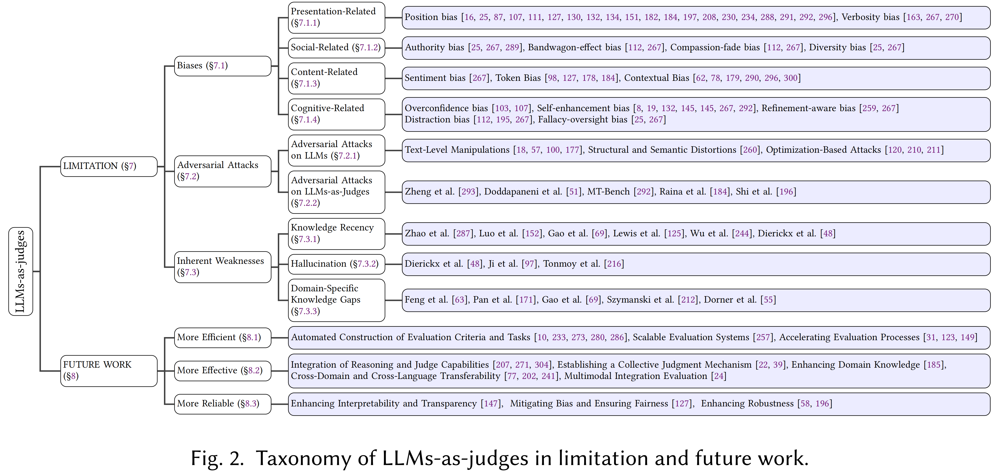

# Awesome-llm-as-judges
[](https://github.com/sponsors)     


## Awesome-llm-as-judges: A Survey
This repo include the papers discussed in our latest survey paper on Awesome-llm-as-judges.

🔥: Read the full paper here: [Paper Link](xxx)

## Reference
If our survey is useful for your research, please kindly cite our [paper](https://arxiv.org/abs/2411.16594):
```
在这里添加引用！
```

## Overview of Awesome-llm-as-judges:



# 1. Functionality

## 1.1 Performance Evaluation
### 1.1.1 Responses Evaluation
- **Llm-eval: Unified multi-dimensional automatic evaluation for open-domain conversations with large language models**. arXiv preprint arXiv:2305.13711 (2023). [[Paper](https://arxiv.org/abs/2305.13711)]
- **Automated Genre-Aware Article Scoring and Feedback Using Large Language Models**. arXiv preprint arXiv:2410.14165 (2024). [[Paper](https://arxiv.org/abs/2410.14165)]
- **Is LLM a Reliable Reviewer? A Comprehensive Evaluation of LLM on Automatic Paper Reviewing Tasks**. In Proceedings of the 2024 Joint International Conference on Computational Linguistics, Language Resources and Evaluation (LREC-COLING 2024). 9340–9351.[[Paper](https://aclanthology.org/2024.lrec-main.816/)]
- **Ares: An automated evaluation framework for retrieval-augmented generation systems**. arXiv preprint arXiv:2311.09476 (2023). [[Paper](https://arxiv.org/abs/2311.09476)]
- **Self-rag: Learning to retrieve, generate, and critique through self-reflection**. arXiv preprint arXiv:2310.11511 (2023). [[Paper](https://arxiv.org/abs/2310.11511)]
- **RecExplainer: Aligning Large Language Models for Explaining Recommendation Models**. In Proceedings of the 30th ACM SIGKDD Conference on Knowledge Discovery and Data Mining. 1530–1541.[[Paper](https://dl.acm.org/doi/10.1145/3637528.3671802)]
### 1.1.2 Model Evaluation
- **Judging llm-as-a-judge with mt-bench and chatbot arena**. Advances in Neural Information Processing Systems 36 (2023), 46595–46623.[[Paper](https://arxiv.org/abs/2306.05685)]
- **Auto Arena of LLMs: Automating LLM Evaluations with Agent Peer-battles and Committee Discussions**. arXiv preprint arXiv:2405.20267 (2024). [[Paper](https://arxiv.org/abs/2405.20267)]
- **VideoAutoArena: An Automated Arena for Evaluating Large Multimodal Models in Video Analysis through User Simulation**. arXiv preprint arXiv:2411.13281 (2024). [[Paper](https://arxiv.org/abs/2411.13281)]
- **Benchmarking foundation models with language-model-as-an-examiner**. Advances in Neural Information Processing Systems 36 (2024).[[Paper](https://arxiv.org/abs/2306.04181)]
- **Kieval: A knowledge-grounded interactive evaluation framework for large language models**. arXiv preprint arXiv:2402.15043 (2024). [[Paper](https://arxiv.org/abs/2402.15043)]
## 1.2 Model Enhancement
### 1.2.1 Reward Modeling During Training
- **Self-rewarding language models**. arXiv preprint arXiv:2401.10020 (2024). [[Paper](https://arxiv.org/abs/2401.10020)]
- **Direct language model alignment from online ai feedback**. arXiv preprint arXiv:2402.04792 (2024). [[Paper](https://arxiv.org/abs/2402.04792)]
- **Rlaif: Scaling reinforcement learning from human feedback with ai feedback**. arXiv preprint arXiv:2309.00267 (2023).[[Paper](https://arxiv.org/abs/2309.00267)]
- **Enhancing Reinforcement Learning with Dense Rewards from Language Model Critic**. In Proceedings of the 2024 Conference on Empirical Methods in Natural Language Processing. 9119–9138.[[Paper](https://aclanthology.org/2024.emnlp-main.515/)]
- **Cream: Consistency regularized self-rewarding language models**. arXiv preprint arXiv:2410.12735 (2024). [[Paper](https://arxiv.org/abs/2410.12735)]
- **The perfect blend: Redefining RLHF with mixture of judges**. arXiv preprint arXiv:2409.20370 (2024). [[Paper](https://arxiv.org/abs/2409.20370)]

### 1.2.2 Acting as Verifier During Inference
- **Regularized Best-of-N Sampling to Mitigate Reward Hacking for Language Model Alignment**. arXiv preprint arXiv:2404.01054 (2024). [[Paper](https://arxiv.org/abs/2404.01054)]
- **Fast Best-of-N Decoding via Speculative Rejection**. arXiv preprint arXiv:2410.20290 (2024). [[Paper](https://arxiv.org/abs/2410.20290)]
- **Tree of thoughts: Deliberate problem solving with large language models**. Advances in Neural Information Processing Systems 36 (2024).[[Paper](https://arxiv.org/abs/2305.10601)]
- **Graph of thoughts: Solving elaborate problems with large language models**. In Proceedings of the AAAI Conference on Artificial Intelligence, Vol. 38. 17682–17690.[[Paper](https://arxiv.org/abs/2308.09687)]
- **Let’s verify step by step**. arXiv preprint arXiv:2305.20050 (2023). [[Paper](https://arxiv.org/abs/2305.20050)]
- **Self-evaluation guided beam search for reasoning**. Advances in Neural Information Processing Systems 36 (2024).[[Paper](https://arxiv.org/abs/2305.00633)]
- **Rationale-Aware Answer Verification by Pairwise Self-Evaluation**. arXiv preprint arXiv:2410.04838 (2024). [[Paper](https://arxiv.org/abs/2410.04838)]
- **Creative Beam Search: LLM-as-a-Judge for Improving Response Generation**. ICCC (2024).[[Paper](https://arxiv.org/abs/2405.00099)]


### 1.2.3 Feedback for Refinement
- **Self-refine: Iterative refinement with self-feedback**. Advances in Neural Information Processing Systems 36 (2024).[[Paper](https://arxiv.org/abs/2303.17651)]
- **Teaching large language models to self-debug**. arXiv preprint arXiv:2304.05128 (2023). [[Paper](https://arxiv.org/abs/2304.05128)]
- **Refiner: Reasoning feedback on intermediate representations**. arXiv preprint arXiv:2304.01904 (2023). [[Paper](https://arxiv.org/abs/2304.01904)]
- **Towards reasoning in large language models via multi-agent peer review collaboration**. arXiv preprint arXiv:2311.08152 (2023). [[Paper](https://arxiv.org/abs/2311.08152)]
- **Large language models cannot self-correct reasoning yet**. arXiv preprint arXiv:2310.01798 (2023). [[Paper](https://arxiv.org/abs/2310.01798)]
- **LLMs cannot find reasoning errors, but can correct them!**. arXiv preprint arXiv:2311.08516 (2023). [[Paper](https://arxiv.org/abs/2311.08516)]
- **Can large language models really improve by self-critiquing their own plans?**. arXiv preprint arXiv:2310.08118 (2023). [[Paper](https://arxiv.org/abs/2310.08118)]

## 1.3 Data Collection
### 1.3.1 Data Annotation
- **If in a Crowdsourced Data Annotation Pipeline, a GPT-4**. In Proceedings of the CHI Conference on Human Factors in Computing Systems. 1–25.[[Paper](https://arxiv.org/abs/2402.16795)]
- **ChatGPT outperforms crowd workers for text-annotation tasks**. Proceedings of the National Academy of Sciences 120, 30 (2023), e2305016120.[[Paper](https://arxiv.org/abs/2303.15056)]
- **ChatGPT-4 outperforms experts and crowd workers in annotating political Twitter messages with zero-shot learning**. arXiv preprint arXiv:2304.06588 (2023). [[Paper](https://arxiv.org/abs/2304.06588)]
- **Fullanno: A data engine for enhancing image comprehension of MLLMs**. arXiv preprint arXiv:2409.13540 (2024). [[Paper](https://arxiv.org/abs/2409.13540)]
- **Can large language models aid in annotating speech emotional data? Uncovering new frontiers**. arXiv preprint arXiv:2307.06090 (2023). [[Paper](https://arxiv.org/abs/2307.06090)]
- **Annollm: Making large language models to be better crowdsourced annotators**. arXiv preprint arXiv:2303.16854 (2023). [[Paper](https://arxiv.org/abs/2303.16854)]
- **LLMAAA: Making large language models as active annotators**. arXiv preprint arXiv:2310.19596 (2023). [[Paper](https://arxiv.org/abs/2310.19596)]

### 1.3.2 Data Synthesize
- **Selfee: Iterative self-revising LLM empowered by self-feedback generation**. Blog post (2023).[[Blog](https://lklab.kaist.ac.kr/SelFee/)]
- **Self-Boosting Large Language Models with Synthetic Preference Data**. arXiv preprint arXiv:2410.06961 (2024). [[Paper](https://arxiv.org/abs/2410.06961)]
- **The fellowship of the LLMs: Multi-agent workflows for synthetic preference optimization dataset generation**. arXiv preprint arXiv:2408.08688 (2024). [[Paper](https://arxiv.org/abs/2408.08688)]
- **Self-consistency improves chain of thought reasoning in language models**. arXiv preprint arXiv:2203.11171 (2022). [[Paper](https://arxiv.org/abs/2203.11171)]
- **WizardLM: Empowering large language models to follow complex instructions**. arXiv preprint arXiv:2304.12244 (2023). [[Paper](https://arxiv.org/abs/2304.12244)]
- **Automatic Instruction Evolving for Large Language Models**. arXiv preprint arXiv:2406.00770 (2024). [[Paper](https://arxiv.org/abs/2406.00770)]
- **STaR: Self-taught reasoner bootstrapping reasoning with reasoning**. In Proc. the 36th International Conference on Neural Information Processing Systems, Vol. 1126.[[Paper](https://arxiv.org/abs/2203.14465)]
- **Beyond human data: Scaling self-training for problem-solving with language models**. arXiv preprint arXiv:2312.06585 (2023). [[Paper](https://arxiv.org/abs/2312.06585)]


# 2. METHODOLOGY
## 2.1 Single-LLM System
### 2.1.1 Prompt-based
#### 2.1.1.1 In-Context Learning
- A survey on in-context learning
arXiv 2022 [Paper](https://arxiv.org/abs/2301.00234)
- Gptscore: Evaluate as you desire
arXiv 2023 [Paper](https://arxiv.org/abs/2302.04166)
- Llm-eval: Unified multi-dimensional automatic evaluation for open-domain conversations with large language models
NLP4ConvAI 2023 [Paper](https://arxiv.org/abs/2305.13711)
- TALEC: Teach Your LLM to Evaluate in Specific Domain with In-house Criteria by Criteria Division and Zero-shot Plus Few-shot
arXiv 2024 [Paper](https://arxiv.org/abs/2407.10999)
- Multi-dimensional evaluation of text summarization with in-context learning
ACL Findings '23 [Paper](https://arxiv.org/abs/2306.01200)
#### 2.1.1.2 Step-by-step
#### 2.1.1.3 Definition Augmentation
#### 2.1.1.4 Multi-turn Optimization

### 2.1.2 Tuning-based
### 2.1.2.1 Score-based Tuning
### 2.1.2.2 Preference-based Learning

### 2.1.3 Post-processing
### 2.1.3.1 Probability Calibration
### 2.1.3.2 Text Reprocessing

## 2.2 Multi-LLM System
### 2.2.1 Communication
#### 2.2.1.1 Cooperation
#### 2.2.1.2 Competition

### 2.2.2 Aggregation

## 2.3 Hybrid System

# 3. APPLICATION
## 3.1 General
## 3.2 Multimodal
## 3.3 Medical
## 3.4 Legal
## 3.5 Financial
## 3.6 Education
## 3.7 Information Retrieval
## 3.8 Others

# 4. META-EVALUATION
## 4.1 Benchmarks
### 4.1.1 Code Generation
### 4.1.2 Machine Translation
### 4.1.3 Text Summarization
### 4.1.4 Dialogue Generation
### 4.1.5 Automatic Story Generation
### 4.1.6 Values Alignment
### 4.1.7 Recommendation
### 4.1.8 Search
### 4.1.9 Comprehensive Data
## 4.2 Metric


# 5. LIMITATION
## 5.1 Biases
### 5.1.1 Presentation-Related Biases
- **Large language models are not robust multiple choice selectors**
  
  ICLR 2024 [**Paper**](https://openreview.net/pdf?id=shr9PXz7T0)

- **Look at the first sentence: Position bias in question answering**
  
  EMNLP 2020 [**Paper**](https://aclanthology.org/2020.emnlp-main.84/)

- **Batch calibration: Rethinking calibration for in-context learning and prompt engineering**
  
  ICLR 2024 [**Paper**](https://openreview.net/pdf?id=L3FHMoKZcS)

- **Beyond Scalar Reward Model: Learning Generative Judge from Preference Data**
  
  ICLR 2025 [**Paper**](https://arxiv.org/abs/2410.03742)

- **Large Language Models Are Zero-Shot Rankers for Recommender Systems**

  ECIR 2024 [**Paper**](https://link.springer.com/chapter/10.1007/978-3-031-56060-6_24) 

- **Position bias in multiple-choice questions**

  Journal of Marketing Research, 1984 [**Paper**](https://www.jstor.org/stable/3151704) 

- **JurEE not Judges: safeguarding llm interactions with small, specialised Encoder Ensembles**

  arXiv preprint, October 2024 [**Paper**](https://arxiv.org/abs/2410.08442) 

- **Split and merge: Aligning position biases in large language model based evaluators**

  EMNLP 2024 [**Paper**](https://aclanthology.org/2024.emnlp-main.621/)

- **Large language models are not fair evaluators**

  ACL 2024 [**Paper**](https://aclanthology.org/2024.acl-long.511/)

- **Debating with more persuasive LLMs leads to more truthful answers**

  International Conference on Learning Representations (ICLR) 2024 [**Paper**](https://openreview.net/forum?id=iLCZtl7FTa)

- **Position bias estimation for unbiased learning to rank in personal search**

  ACM International Conference on Web Search and Data Mining (WSDM) 2018 [**Paper**](https://dl.acm.org/doi/pdf/10.1145/3159652.3159732)

- **PRD: Peer rank and discussion improve large language model based evaluations**

  arXiv preprint, July 2023 [**Paper**](https://openreview.net/forum?id=CbmAtAmQla)

- **Humans or LLMs as the judge? A study on judgement biases**

  EMNLP 2024 [**Paper**](https://aclanthology.org/2024.emnlp-main.474.pdf)

- **Is LLM-as-a-Judge Robust? Investigating Universal Adversarial Attacks on Zero-shot LLM Assessment**

  EMNLP 2024 [**Paper**](https://aclanthology.org/2024.emnlp-main.427/)

- **Judging the Judges: A Systematic Investigation of Position Bias in Pairwise Comparative Assessments**

  arXiv preprint, June 2024 [**Paper**](https://arxiv.org/html/2406.07791v5)

- **Generative judge for evaluating alignment**

  International Conference on Learning Representations (ICLR) 2024 [**Paper**](https://openreview.net/forum?id=0kokhUetZ3)

- **Judging LLM-as-a-Judge with MT-Bench and Chatbot Arena**

  NeurIPS 2023 [**Paper**](https://papers.nips.cc/paper_files/paper/2023/hash/91f18a1287b398d378ef22505bf41832-Abstract-Datasets_and_Benchmarks.html) 

- **Justice or prejudice? quantifying biases in llm-as-a-judge**
  
  NeurIPS 2024 Workshop SafeGenAi 2024 [**Paper**](https://openreview.net/pdf?id=wtscPS2zJH)
### 5.1.2 Social-Related Biases

- **Benchmarking Cognitive Biases in Large Language Models as Evaluators**

  Findings of ACL 2024 [**Paper**](https://aclanthology.org/2024.findings-acl.29/)

- **Justice or Prejudice? Quantifying Biases in LLM-as-a-Judge**

  SFLLM Workshop @ NeurIPS 2024 [**Paper**](https://arxiv.org/abs/2410.02736)

- **Humans or LLMs as the Judge? A Study on Judgement Bias**

  EMNLP 2024 [**Paper**](https://aclanthology.org/2024.emnlp-main.474/) 
### 5.1.3 Content-Related Biases
- **Calibrate Before Use: Improving Few-Shot Performance of Language Models**

  ICML 2021 [**Paper**](https://arxiv.org/pdf/2102.09690)

- **Mitigating Label Biases for In-Context Learning**

  ACL 2023 [**Paper**](https://aclanthology.org/2023.acl-long.783/)

- **Prototypical Calibration for Few-Shot Learning of Language Models**

  ICLR 2023 [**Paper**](https://openreview.net/forum?id=0VWe0yBPxg)

- **Justice or Prejudice? Quantifying Biases in LLM-as-a-Judge**

  SFLLM Workshop @ NeurIPS 2024 [**Paper**](https://arxiv.org/abs/2410.02736)

- **Are Large Language Models Rational Investors?**

  arXiv preprint 2024 [**Paper**](https://arxiv.org/html/2402.12713v1)

- **Bias Patterns in the Application of LLMs for Clinical Decision Support: A Comprehensive Study**

  arXiv preprint 2024 [**Paper**](https://arxiv.org/html/2404.15149)

- **Batch Calibration: Rethinking Calibration for In-Context Learning and Prompt Engineering**

  ICLR 2024 [**Paper**](https://openreview.net/pdf?id=SkEG9q1Rtw) 
### 5.1.4 Cognitive-Related Biases
- **Justice or Prejudice? Quantifying Biases in LLM-as-a-Judge**

  SFLLM Workshop @ NeurIPS 2024 [**Paper**](https://arxiv.org/abs/2410.02736)

- **Large Language Models Can Be Easily Distracted by Irrelevant Context**

  arXiv preprint 2024 [**Paper**](https://arxiv.org/abs/2403.12345)

- **Reference-Guided Verdict: LLMs-as-Judges in Automatic Evaluation of Free-Form Text**

  ACL 2024 [**Paper**](https://aclanthology.org/2024.acl-long.123/)

- **PRD: Peer Rank and Discussion Improve Large Language Model Based Evaluations**

  ICLR 2024 [**Paper**](https://openreview.net/pdf?id=H1x3QZ9tW)

- **Trust or Escalate: LLM Judges with Provable Guarantees for Human Agreement**

  NeurIPS 2024 [**Paper**](https://papers.nips.cc/paper/2024/hash/abc123.pdf)

- **Pride and Prejudice: LLM Amplifies Self-Bias in Self-Refinement**

  ACL 2024 [**Paper**](https://aclanthology.org/2024.acl-long.826/)

- **Humans or LLMs as the Judge? A Study on Judgement Biases**

  arXiv preprint 2024 [**Paper**](https://arxiv.org/abs/2402.10669)

- **Evaluations of Self and Others: Self-Enhancement Biases in Social Judgments**

  Journal of Personality and Social Psychology, 2024 [**Paper**](https://doi.org/10.1037/pspa0000300)

- **Judging LLM-as-a-Judge with MT-Bench and Chatbot Arena**

  arXiv preprint 2023 [**Paper**](https://arxiv.org/abs/2306.05685)

- **G-Eval: NLG Evaluation Using GPT-4 with Better Human Alignment**

  EMNLP 2024 [**Paper**](https://aclanthology.org/2024.emnlp-main.123/)

- **Benchmarking Cognitive Biases in Large Language Models as Evaluators**

  Findings of ACL 2024 [**Paper**](https://aclanthology.org/2024.findings-acl.29/)

- **Debating with More Persuasive LLMs Leads to More Truthful Answers**

  ICLR 2024 [**Paper**](https://openreview.net/pdf?id=shr9PXz7T0) 
## 5.2 Adversarial Attacks
### 5.2.1 Adversarial Attacks on LLMs
- **HotFlip: White-Box Adversarial Examples for Text Classification**

  ACL 2018 [**Paper**](https://aclanthology.org/P18-2006/)

- **Query-Efficient and Scalable Black-Box Adversarial Attacks on Discrete Sequential Data via Bayesian Optimization**

  ICML 2022 [**Paper**](https://proceedings.mlr.press/v162/lee22h.html)

- **Adv-BERT: BERT is Not Robust on Misspellings! Generating Natural Adversarial Samples on BERT**

  arXiv preprint 2019 [**Paper**](https://arxiv.org/abs/1904.06607)

- **An LLM Can Fool Itself: A Prompt-Based Adversarial Attack**

  arXiv preprint 2023 [**Paper**](https://arxiv.org/abs/2303.12345)

- **Natural Backdoor Attack on Text Data**

  EMNLP 2021 [**Paper**](https://aclanthology.org/2021.emnlp-main.123/)

- **Ignore Previous Prompt: Attack Techniques for Language Models**

  arXiv preprint 2023 [**Paper**](https://arxiv.org/abs/2304.12345)

- **Prompt Packer: Deceiving LLMs through Compositional Instruction with Hidden Attacks**

  NeurIPS 2023 [**Paper**](https://papers.nips.cc/paper/2023/hash/abc123.pdf)

- **Evaluating the Susceptibility of Pre-Trained Language Models via Handcrafted Adversarial Examples**

  ACL 2022 [**Paper**](https://aclanthology.org/2022.acl-long.456/) 
### 5.2.2 Adversarial Attacks on LLMs-as-Judges
- **Cheating Automatic LLM Benchmarks: Null Models Achieve High Win Rates**  
  SafeGenAI @ NeurIPS 2024 [**Paper**](https://arxiv.org/abs/2410.07137)  

- **Optimization-based Prompt Injection Attack to LLM-as-a-Judge**  
  arXiv 2024 [**Paper**](https://arxiv.org/pdf/2403.17710)  

- **Finding Blind Spots in Evaluator LLMs with Interpretable Checklists**  
  EMNLP 2024 [**Paper**](https://aclanthology.org/2024.emnlp-main.911/)  

- **Judging LLM-as-a-Judge with MT-Bench and Chatbot Arena**  
  NeurIPS 2023 Datasets and Benchmarks Track [**Paper**](https://papers.nips.cc/paper_files/paper/2023/hash/91f18a1287b398d378ef22505bf41832-Abstract-Datasets_and_Benchmarks.html)  

- **Scaling Instruction-Finetuned Language Models**  
  Journal of Machine Learning Research 2024 [**Paper**](https://jmlr.org/papers/v25/23-0870.html)  

- **Is LLM-as-a-Judge Robust? Investigating Universal Adversarial Attacks on Zero-shot LLM Assessment**  
  EMNLP 2024 [**Paper**](https://aclanthology.org/2024.emnlp-main.427/)  
## 5.3 Inherent Weaknesses
### 5.3.1 Knowledge Recency
- **Retrieval-Augmented Generation for Large Language Models: A Survey**  
  arXiv 2023 [**Paper**](https://arxiv.org/abs/2306.07835)

- **Retrieval-Augmented Generation for Knowledge-Intensive NLP Tasks**  
  NeurIPS 2020 [**Paper**](https://proceedings.neurips.cc/paper/2020/file/6b493230205f780e1bc26945df7481e5-Paper.pdf)

- **An Empirical Study of Catastrophic Forgetting in Large Language Models During Continual Fine-Tuning**  
  arXiv 2023 [**Paper**](https://arxiv.org/abs/2308.08747)

- **Continual Learning for Large Language Models: A Survey**  
  arXiv 2024 [**Paper**](https://arxiv.org/abs/2402.01364)

- **Striking the Balance in Using LLMs for Fact-Checking: A Narrative Literature Review**  
  MISDOOM 2024 [**Paper**](https://link.springer.com/chapter/10.1007/978-3-031-71210-4_1) 
### 5.3.2 Hallucination
- **Striking the Balance in Using LLMs for Fact-Checking: A Narrative Literature Review**  
  MISDOOM 2024 [**Paper**](https://link.springer.com/chapter/10.1007/978-3-031-71210-4_1) 
  
### 5.3.3 Domain-Specific Knowledge Gaps
- **Knowledge Solver: Teaching LLMs to Search for Domain Knowledge from Knowledge Graphs**  
  arXiv 2023 [**Paper**](https://arxiv.org/pdf/2309.03118)

- **Unifying Large Language Models and Knowledge Graphs: A Roadmap**  
  arXiv 2023 [**Paper**](https://arxiv.org/pdf/2306.08302)

- **Retrieval-Augmented Generation for Large Language Models: A Survey**  
  arXiv 2023 [**Paper**](https://arxiv.org/abs/2306.07835) 


- **The fellowship of the LLMs: Multi-agent workflows for synthetic preference optimization dataset generation**. *Samee Arif, Sualeha Farid, Abdul Hameed Azeemi, Awais Athar, Agha Ali Raza* arXiv preprint arXiv:2408.08688 (2024). [[Paper](https://arxiv.org/abs/2408.08688)]
