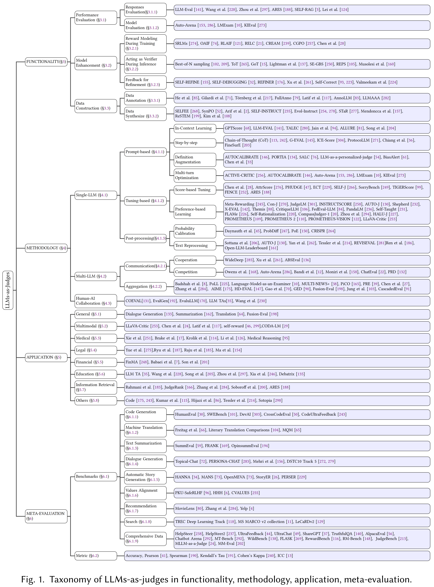

# Awesome-llm-as-judges
[](https://github.com/sponsors)     


## Awesome-llm-as-judges: A Survey
This repo include the papers discussed in our latest survey paper on Awesome-llm-as-judges.

🔥: Read the full paper here: [Paper Link](xxx)

## Reference
If our survey is useful for your research, please kindly cite our [paper](https://arxiv.org/abs/2411.16594):
```
在这里添加引用！
```

## Overview of Awesome-LLM-as-a-judge:



# 1. Functionality

## 1.1 Performance Evaluation
### 1.1.1 Responses Evaluation
### 1.1.2 Model Evaluation

## 1.2 Model Enhancement
### 1.2.1 Reward Modeling During Training
### 1.2.2 Acting as Verifier During Inference
### 1.2.3 Feedback for Refinement

## 1.3 Data Collection
### 1.3.1 Data Annotation
### 1.3.2 Data Synthesize

# 2. METHODOLOGY
## 2.1 Single-LLM System
### 2.1.1 Prompt-based
#### 2.1.1.1 In-Context Learning
- A survey on in-context learning
arXiv 2022 [Paper](https://arxiv.org/abs/2301.00234)
- Gptscore: Evaluate as you desire
arXiv 2023 [Paper](https://arxiv.org/abs/2302.04166)
- Llm-eval: Unified multi-dimensional automatic evaluation for open-domain conversations with large language models
NLP4ConvAI 2023 [Paper](https://arxiv.org/abs/2305.13711)
- TALEC: Teach Your LLM to Evaluate in Specific Domain with In-house Criteria by Criteria Division and Zero-shot Plus Few-shot
arXiv 2024 [Paper](https://arxiv.org/abs/2407.10999)
- Multi-dimensional evaluation of text summarization with in-context learning
ACL Findings '23 [Paper](https://arxiv.org/abs/2306.01200)
#### 2.1.1.2 Step-by-step
#### 2.1.1.3 Definition Augmentation
#### 2.1.1.4 Multi-turn Optimization

### 2.1.2 Tuning-based
### 2.1.2.1 Score-based Tuning
### 2.1.2.2 Preference-based Learning

### 2.1.3 Post-processing
### 2.1.3.1 Probability Calibration
### 2.1.3.2 Text Reprocessing

## 2.2 Multi-LLM System
### 2.2.1 Communication
#### 2.2.1.1 Cooperation
#### 2.2.1.2 Competition

### 2.2.2 Aggregation

## 2.3 Hybrid System

# 3. APPLICATION
## 3.1 General
## 3.2 Multimodal
## 3.3 Medical
## 3.4 Legal
## 3.5 Financial
## 3.6 Education
## 3.7 Information Retrieval
## 3.8 Others

# 4. META-EVALUATION
## 4.1 Benchmarks
### 4.1.1 Code Generation
### 4.1.2 Machine Translation
### 4.1.3 Text Summarization
### 4.1.4 Dialogue Generation
### 4.1.5 Automatic Story Generation
### 4.1.6 Values Alignment
### 4.1.7 Recommendation
### 4.1.8 Search
### 4.1.9 Comprehensive Data
## 4.2 Metric


# 5. LIMITATION
## 5.1 Biases
### 5.1.1 Presentation-Related Biases
### 5.1.2 Social-Related Biases
### 5.1.3 Content-Related Biases
### 5.1.4 Cognitive-Related Biases

## 5.2 Adversarial Attacks
### 5.2.1 Adversarial Attacks on LLMs
### 5.2.2 Adversarial Attacks on LLMs-as-Judges

## 5.3 Inherent Weaknesses
### 5.3.1 Knowledge Recency
### 5.3.2 Hallucination
### 5.3.3 Domain-Specific Knowledge Gaps

